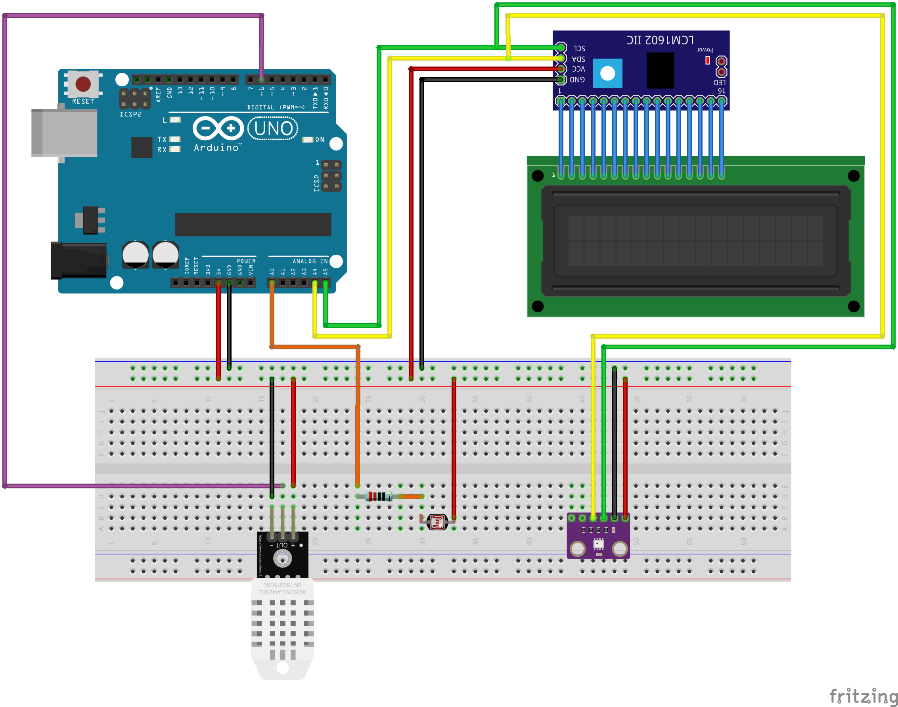

# Arduino-Weather-Station
Proyecto arduino con el que se pretende controlar varios sensores (formando una estación meteorológica) y almacenarlos en una BD.
---

El proyecto tiene el objetivo de implementar una estación meteorológica. 

En una primera fase medirá temperatura, humedad, presión atmosférica y luminosidad. 

> Hay que estudiar si es factible realizar una medición de la dirección y velocidad del viento (segunda fase). 

Una vez implementada hay que recoger los datos desde una fuente externa como una RPi o el microserver ya implementado para otros menesteres (corriendo una debian sin entorno gráfico). 

Para ello es necesario seleccionar el método de conexión Ardunio - RPi/Microserver (lo nombraremos DataCenter para abreviar). Por distancia parece conveniente utilzar el metodo de conexión Wi-Fi.

Una vez resuelto el problema de comunicación hay que estudiar si las peticiones de datos las lanza DataCenter o si Arduino es la encargada de lanzar los datos.

Los datos obtenidos seran almacenados en una BD basada en MariaDB siguiendo la filosofia Open source.

Hay que intentar que una vez obtenidos los datos se realice un análisis de los mismos e incluso se puedan realizar pequeñas predicciones.

> Queda pendiente añadir alguna mejora más como dirección del viento o velocidad del mismo.

## Componentes

Los componentes a utilizar para iniciar el proyecto:

* Arduino UNO / Arduino Nano (una vez el proyecto sea viable).
* Sensor DHT22 (Temperatura y humedad).
* Sensor BMP280 (Presión atmosférica).
* Sensor LDR (Luminosidad).
* Resistencias (220 Oms, 10K Oms, etc).
* Display LCD 16x2 conectado con I2C.
* Botones.
* Módulo Wi-Fi.
* Caja impresa en 3D.
* Chip para conexiones.
* Protoboard (Hasta que quede montado en chip).

---

## Diseño esquema montaje

> Pendiente de modificar y/o añadir componentes segun se vaya planteando el proyecto.

Diseñado con fritzig.



## Diseño BBDD.

El motor de BBDD utilizado es MariaDB. En este momento el server core es la versión 10.3.

La BD contiene 4 tablas:

* Temperature.
* Preasure.
* Humidity.
* Brightness.

Cada tabla comparte la misma estructura (3 campos de datos)  solo cambia el nombre del campo de datos.

Campos:

* ID - Tipo INT (auto incremental).
* DATA - Tipo FLOAT (temperature, preasure, humidity, brightness).
* DATE - Tipo TIMESTAMP (current_timestamp).

## Configuración del servidor.

Para implementar el servidor instalaremos apache2, php7.3 (actualmente la versión estable), mariadb
```bash
sudo apt update
sudo apt install apache2
sudo apt install php7.3
sudo apt install mariadb
```

Instalamos el módulo de php para usar PDO y conectar con la BD.
```bash
sudo apt install php7.3-mysql
```
## Presentación de los datos.

La interfaz gráfica (UI) esta basada en una web usando HTML5, CSS3 y JavaScript junto con las librerias de Bootstrap v4, JQuery, Chart.js y Fonts Awesome.

La comunicación cliente-servidor la realizaremos a traves de una dicha web. JavaScript utilizaJSON para la obtención de los datos. 

Los datos en formato JSON son solicitados a traves de una url a la cual se le pueden pasar un parametro para obtener datos de diferentes consultas.

Consultas:

* Últimos 20 datos almacenados en la BD de temperatura.
* Últimos 20 datos almacenados en la BD de humedad.
* Últimos 20 datos almacenados en la BD de presión atmosférica.
* Últimos 20 datos almacenados en la BD de luminosidad.

Ese JSON es formado por php en la parte del servidor obteniendo los datos de la BD en donde se encuentran almacenados los datos de los sensores obtenidos con arduino.  

El fichero JSON es tratado en el código javascript para visualizar las gráficas con la libreria Chart.js.

## Hoja de Ruta.

Se plantea el uso de la API de OpenWeatherMap para conseguir datos de otras estaciones y comparar con los datos de arduino y/o ampliar la información.
También se plantea el uso de la API OpenData de AEMET pero la observación de las estaciones de Palma no parecen actualizarse continuamente tal y como indican en la documentación para desarrolladores.

Como aun no hay sensores suficientes para hacer el desarrollo con arduino la web se va a ir alimentando de las APIs mencionadas anteriormente.

Open Weather Maps ID Cities:
/*
	 * 1- 2512989 - Palma - MALLORCA
	 * 2- 2514097 - Marratxi - MALLORCA
	 * 3- 2520493 - Calvia - MALLORCA
	 * 4- 2514216 - Manacor - MALLORCA
	 * 8- 2521741 - Andratx - MALLORCA
	 * 9- 2516452 - Inca - MALLORCA
	 * 10- 2510821 - Soller - MALLORCA
	 * 11- 2512432 - Pollença - MALLORCA
	 * 12- 2521534 - Arta - MALLORCA
	 * 13- 2511106 - Santanyi - MALLORCA
	 * 14- 2514984 - Llucmajor - MALLORCA
	 */